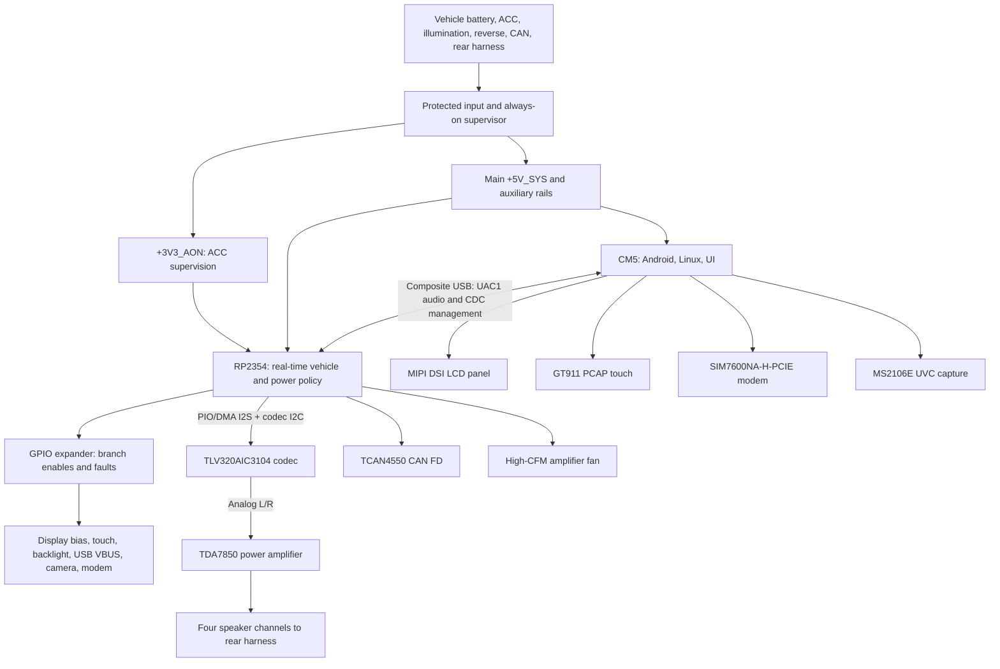

# OpenXTCM5

OpenXTCM5 is an in-progress open-hardware project for building a capable, repairable Android automotive head unit around a Raspberry Pi Compute Module 5 (CM5) and an RP2354 real-time controller.

> [!NOTE]
> This is a personal, evolving engineering project. The schematic and documentation describe current intent, not a production guarantee, until the design has been laid out, built, and validated on hardware.

## Why This Exists

This began as both a learning project and a response to the inexpensive Android head units that are common in aftermarket vehicle installs. The unit currently in use overheats around its TDA7388 audio amplifier. Once heat builds up, Android becomes severely laggy, reverse-camera use can freeze the system, and audio can repeat the last fragment played until the unit reboots.

The aim is not just to replace that unit, but to understand and improve the entire design: protected automotive power, controlled startup and shutdown, display integration, vehicle I/O, communications, camera capture, audio, and thermal management. A high-CFM amplifier fan is planned so the audio stage is no longer allowed to quietly cook the rest of the system.

## Current Architecture

The KiCad design is organized as a set of focused hierarchical sheets rather than one monolithic schematic. Together they describe a head unit with a Linux/Android application processor, a separate real-time vehicle controller, independently recoverable peripheral domains, and a deliberately serviceable USB path.

The **CM5** runs Android, Linux device drivers, the display stack, touch input, modem and camera applications, and the user-facing audio policy. The **RP2354** owns real-time vehicle policy: ignition handling, power sequencing, low-level fault response, CAN FD, audio-codec control, amplifier/fan behavior, and branch-rail recovery. A TCA9539A-Q1 I/O expander gives the RP2354 additional low-rate enables and fault inputs without putting timing-sensitive work on I2C.

Android requests vehicle-facing actions through a framed USB management interface. It does not directly own switched vehicle rails or the system power latch. That separation is intentional: the RP2354 remains able to impose a safe timeout or load-shedding policy if Android or the CM5 USB link is unavailable.

### Power and Lifecycle

The power architecture begins at the rear vehicle harness with protected battery input, reverse-polarity and transient protection, and a low-IQ always-on domain. `+3V3_AON` supervises the vehicle ignition signal while the rest of the computer is off. A main buck-boost stage creates `+5V_SYS`, which enables the normal 3.3 V and 1.8 V rails for the CM5 and RP2354.

`ACC_OK` is an observation of vehicle state; `SYS_HOLD` is an RP2354-owned command that temporarily holds the main system rail alive after ACC falls. This bounded shutdown lease gives Android time to flush storage and shut down cleanly, but it cannot keep the vehicle-powered system awake forever if the CM5 crashes. The current design targets a measured cold boot after shutdown, not assumed hibernate or RAM retention.

The **Power - Vehicle Input & System 5V**, **Power - Auxiliary Rails**, and **Power - Load Switches & Faults** sheets distinguish global power from recoverable branches. The RP2354 can independently control or restart LCD logic and bias, the GT911 touch rail, backlight, external USB VBUS, camera supplies, and the modem supply. Branch switching exists for recovery, fault containment, external-connector protection, or load shedding; it is not used merely to make the schematic look modular.

### Compute, Control, and Recovery

The **Compute - Raspberry Pi CM5** sheet carries the Android-facing interfaces. The CM5 drives the MIPI DSI display, hosts the GT911 on a dedicated I2C bus, hosts the modem and camera USB devices, and communicates with the RP2354 over the internal USB link.

The **Control - RP2354** sheet is the board's deterministic layer. Its direct GPIOs handle CAN SPI, amplifier mute and standby, fan PWM/tach, system hold, codec I2S and I2C, vehicle comparators, and recovery signals. The TCA9539A-Q1 expander is reserved for slower rail enables, status indication, and active-low fault reporting. This keeps timing-sensitive audio, CAN, and power-latch functions away from an expander transaction.

The CM5 can place the RP2354 in USB BOOTSEL mode through isolated reset and QSPI-SS assertion circuits. Separately, the RP2354 may signal the CM5 through an open-drain attention line and a proposed CM5 power-button pull-down. The former is a doorbell for USB messages; neither signal replaces the normal USB protocol.

### Display and Touch

The display domain spans **Display - Panel & Touch Connector** and **Display - Bias & Backlight**. The CM5 supplies four-lane MIPI DSI video and controls the panel's translated reset and standby signals. LCD logic uses a switchable 1.8 V branch, while a TPS65150-based bias supply generates the panel's analog rails such as AVDD, VGH, VGL, and VCOM. Those domains can be sequenced and power-cycled without rebooting the CM5.

The GT911 projected-capacitive touch controller uses its own six-pin FFC connector, separate from the LCD FFC. It is powered from `TOUCH_3V3_SW`; CM5 GPIO10/GPIO11 provide I2C data and clock with pull-ups on that switched touch rail, while GPIO2 and GPIO3 provide reset and interrupt/address-selection behavior. This allows the touch controller to be restarted without back-powering it through an always-on I2C pull-up.

The backlight is also independent. A TPS61165 boost driver supplies the panel LED connector, and `BACKLIGHT_EN` gives the controller a fast way to remove a meaningful display load during a crank or controlled shutdown while preserving the rest of the system state.

### Audio and Thermal

The audio path crosses **Audio - I2S Bridge**, **Audio - Power Amplifier**, and **Thermal - Fan Control**. The RP2354 bridges CM5 USB audio to the TLV320AIC3104 codec over I2S; the codec's analog left/right outputs feed the TDA7850's four speaker channels. The RP2354 also owns amplifier mute/standby and the separate high-CFM amplifier fan, while the CM5 has its own low-power cooling connection.

The USB-audio profile, codec configuration, PIO/DMA buffering, clock synchronization, fault behavior, and validation plan are defined in the [RP2354 Firmware Platform Decision](docs/rp2354-firmware-platform.md) and [Firmware Implementation Plan](docs/firmware-implementation-plan.md).

### Vehicle, Connectivity, and External Devices

The **Vehicle IO - Rear Harness** sheet carries speaker output, vehicle power and sense signals, the external reverse-camera connection, and the other harness-facing interfaces. `REVERSE_OK`, `ILLUM_OK`, and `ACC_OK` are hardware observations that inform RP2354 policy rather than direct software-controlled outputs. The **Vehicle IO - CAN FD** sheet uses a TCAN4550 controlled through RP2354 SPI.

The **Connectivity - USB Hub & Ports** and **Connectivity - Cellular Modem** sheets separate user-accessible USB, service USB, and modem behavior:

- A switched external USB VBUS branch protects the user-facing host port and lets firmware shed it under a fault or low-voltage event.
- `J1402` is a self-powered USB-C data/maintenance port for CM5 storage recovery. Its VBUS pin is intentionally not a board power input.
- The SIM7600NA-H-PCIE modem uses a dedicated switched 3.3 V domain and a direct CM5 USB host path. Its high burst-current supply, reset, and fault reporting are kept separate from general 3.3 V logic.
- The first-board reverse-camera path uses a switched external camera supply and an MS2106E CVBS-to-USB UVC capture subsystem. A native CSI-2 camera design remains a later, independent investigation.

### Schematic Domains

| KiCad hierarchy | What it contributes to the current design |
| --- | --- |
| Power - Vehicle Input & System 5V | Protected input, always-on ACC supervision, `+5V_SYS`, and `SYS_HOLD` behavior. |
| Power - Auxiliary Rails | Main 3.3 V and 1.8 V distribution and the domains that depend on system-rail validity. |
| Power - Load Switches & Faults | Controlled branch rails, fault reporting, and GPIO-expander ownership. |
| Control - RP2354 | Real-time controller, recovery controls, vehicle observations, codec clocks, and GPIO allocation. |
| Compute - Raspberry Pi CM5 | Android host, display/touch controls, USB hosts, maintenance port, and CM5-facing recovery signals. |
| Display - Panel & Touch Connector | MIPI DSI panel FFC, standalone GT911 touch FFC, and level-shifted panel control signals. |
| Display - Bias & Backlight | LCD bias generation, panel analog rails, and LED boost/backlight control. |
| Audio - I2S Bridge / Audio - Power Amplifier | RP2354-to-codec I2S, codec analog outputs, amplifier control, and speaker drive. |
| Thermal - Fan Control | Amplifier-fan supply, active-low PWM control, and tachometer feedback. |
| Vehicle IO - Rear Harness / CAN FD | Vehicle-facing signals, speakers, camera interface, and CAN FD transport. |
| Connectivity - USB Hub & Ports / Cellular Modem | External USB protection, service USB, modem power and USB transport. |
| Video - Reverse Camera Capture | Switched camera power and first-board UVC capture path. |

## Project Status

The hardware schematic is in its initial, pre-production design stage. Major subsystem architecture is documented, but parent-sheet connections, ERC cleanup, placement, routing, and prototype validation remain. There is no fabricated PCB or validated hardware yet.

Hardware, RP2354 firmware, and CM5/Android software are separate deliverables and may evolve on different schedules. Their revision history belongs with the relevant artifact: the PCB release-note table on page 1 of the top-level schematic for hardware, and dedicated changelogs for firmware or software once those components are introduced.

## Documentation

See [docs/README.md](docs/README.md) for the complete documentation index. Key records:

- [RP2354 Firmware Platform Decision](docs/rp2354-firmware-platform.md): Pico SDK/TinyUSB choice, direct USB Audio-to-I2S design, validation gates, and Zephyr revisit criteria.
- [Firmware Implementation Plan](docs/firmware-implementation-plan.md): RP2354 GPIO allocation, power lifecycle, recovery, audio, and peripheral contracts.
- [Android Bring-Up](docs/android-bring-up.md): staged CM5 Linux/Android, display, touch, USB, audio, modem, camera, and vehicle-integration plan.
- [Power Control Rationale](docs/power-control-rationale.md): power-domain decisions, switch ownership, sequencing, and fault handling.
- [Portfolio Design Journal](docs/portfolio/openxtcm5-head-unit/openxtcm5-head-unit.md): longer narrative of the project and the engineering decisions behind it.

## Repository Layout

* `pcb/` - KiCad project, schematic sheets, footprints, and local library material
* `docs/` - design rationale, decision records, integration plans, and portfolio material
