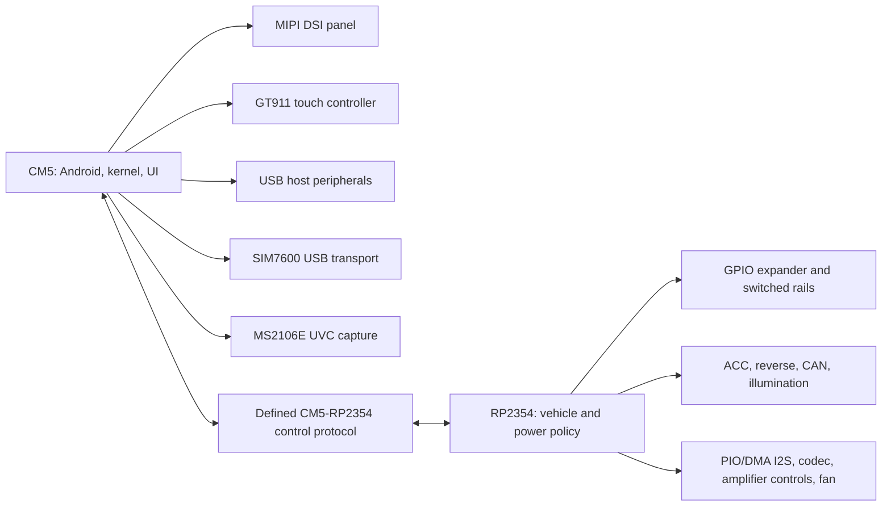

# OpenXTCM5 Android Bring-Up

**Status:** Working plan. The schematic is still being completed; no PCB or Android device tree has been validated on hardware.  
**Scope:** Bring a CM5-based Android system up in small, observable steps while preserving the RP2354 as the owner of vehicle-facing power and real-time policy.

This document is the top-level software bring-up order. It deliberately does not replace the power-control rationale, the RP2354 firmware contract, the modem plan, or the camera plan. Those records define subsystem details; this one defines the order in which Android, Linux, and the board should earn trust.

## 1. Ownership Boundary

The CM5 owns Android, Linux device drivers, the user interface, USB-host peripherals, display presentation, touch input, modem data services, and the camera application. The RP2354 owns vehicle-state acquisition, controlled power sequencing, low-level fault response, amplifier/fan policy, and branch-rail recovery.

Android must request vehicle-facing actions through a documented CM5-to-RP2354 control interface. It must not assume that it can directly turn on a switched rail merely because the associated device is visible in the UI.

The planned normal CM5/RP2354 transport is the internal `MCU_USB_D+` / `MCU_USB_D-` host-to-device link. In normal RP2354 firmware, it enumerates as a composite device: a UAC1 audio interface for PCM playback and a CDC ACM interface for the versioned board-management protocol. These interfaces share a cable but are logically separate. The same physical link is reused only during explicit RP2354 BOOTSEL recovery, when it enumerates as a Boot ROM device instead.

`RP2354_TO_CM5_ATTN_N` is a proposed active-low, open-drain doorbell from RP2354 GPIO32 to CM5 GPIO17 / module pin 50. It is not a data channel and does not carry a shutdown acknowledgement. It exists so the CM5 service can promptly read the authoritative USB message queue.

## 2. Hardware-Software Contract

| Function | Hardware boundary | Android/Linux responsibility | Status |
| --- | --- | --- | --- |
| Display | Four-lane MIPI DSI panel connection, `LCD_1V8_SW`, panel-bias rails, backlight driver | Bind the selected panel driver, describe supplies and timing in device tree, own display presentation | Panel selection and timing validation pending |
| Panel control | CM5 GPIO4 `~{LCD_RESET}` and GPIO5 `~{LCD_STBYB}` through a 3.3 V-to-1.8 V translator | Expose them to the selected panel driver and sequence them per the panel data sheet | GPIOs reserved; parent-sheet links still need completion |
| Touch | GT911 on CM5 I2C1: GPIO10 SDA and GPIO11 SCL; GPIO2 reset; GPIO3 interrupt/address strap | Enable the Goodix kernel driver, describe reset/interrupt GPIOs and I2C address, expose an Android input device | Hardware path defined; prove after panel power is stable |
| USB host | CM5 host paths to hub, modem, UVC capture, and the RP2354 composite audio/management/recovery device | Enumerate, identify stable topology, apply required Android USB permissions and policies | Parent-sheet recovery link pending |
| Power lifecycle | Runtime USB management link, `RP2354_TO_CM5_ATTN_N`, RP-owned `SYS_HOLD`, and proposed RP-controlled CM5 `PWR_BUT` pull-down | Run the board-management daemon; acknowledge ignition loss, quiesce Android, and report `SHUTDOWN_READY` before power removal | Initial message and timeout contract defined; parent links and the `PWR_BUT` transistor still need schematic implementation |
| USB maintenance | J1402, a self-powered USB 2.0 CM5 device/UFP port for host-assisted eMMC/flash recovery | Keep this port out of normal Android runtime policy; use it with `nRPIBOOT` for privileged recovery and provisioning | VBUS NC; independent 5.1 kOhm UFP Rd pull-downs on CC1/CC2; optional protected VBUS detection remains a bring-up decision |
| Modem | SIM7600NA-H-PCIE over dedicated CM5 USB; power/reset/flight-mode controls remain on the RP2354 side | Start with USB enumeration, AT transport, and data; defer telephony and call audio | Basic hardware and exact module USB composition need validation |
| Camera | First-board MS2106E USB UVC capture path; separate camera power policy owned by RP2354 | Use V4L2/UVC first; build a reverse-camera application path only after stable capture | Native CSI-2 is future work |
| Audio | CM5 USB host to RP2354 UAC1 device; RP2354 PIO/DMA I2S master to TLV320AIC3104; L/R analog into TDA7850 | Validate UAC1 playback in Linux, then bind the stable ALSA device into Android audio policy | Rev A topology and firmware framework selected; bench validation pending |
| Vehicle state | ACC, reverse, illumination, CAN, and branch faults terminate at RP2354 | Consume the versioned USB management protocol; do not bypass RP2354 power policy with direct GPIO control | Initial protocol defined; implementation and validation pending |

## 3. Bring-Up Rules

1. Prove each subsystem in Linux before relying on Android framework behavior.
2. Change one layer at a time: electrical state, kernel/device tree, Linux userspace, then Android framework or application behavior.
3. Log power and fault state at every failure. A missing device might be a driver problem, an unpowered branch, a reset state, or an RP2354 policy decision.
4. Keep all optional branch rails disabled by default until the RP2354 firmware has initialized the GPIO expander and written its safe output state.
5. Do not add Android policy for a device until repeated cold boot, reset, and power-cycle tests work from Linux.

## 4. Stage 0: Reproducible Software Baseline

Before custom hardware support, create a record containing:

- The selected Android distribution/source tree, branch, manifest revision, kernel tree, bootloader/firmware versions, and build host dependencies.
- The CM5 EEPROM, boot order, storage device, serial-console configuration, and recovery procedure.
- The J1402 recovery procedure: power the board from the normal vehicle/bench supply, assert `nRPIBOOT`, connect J1402 directly to the host, then use the approved `rpiboot`/imaging workflow to recover the onboard eMMC/flash. J1402 VBUS is not a board power source.
- A version-controlled board device-tree source and an overlay strategy. Do not make the running device tree the only copy of board configuration.
- A test image that preserves serial or network access even if the display stack fails.

**Exit criteria:** the unmodified CM5 image boots repeatedly, exposes a dependable console, and can be rebuilt from the recorded source revisions.

### Boot and Resume Strategy

Automotive Android systems normally pursue two different goals:

1. **Make a true cold boot shorter.** The application processor starts from no RAM retention, so every stage from boot ROM through the visible Android UI must be measured and trimmed.
2. **Avoid a cold boot when the parked-current budget permits it.** A vehicle controller asks Android to suspend or shut down and later supplies a defined wake event. This is a managed standby/resume feature, not a vague request to keep the processor alive.

Android Automotive's reference architecture uses a vehicle microcontroller to send Android formal power-state requests such as `SHUTDOWN_PREPARE`, `ON`, and `CANCEL_SHUTDOWN`. RP2354 plays the equivalent board-management role in OpenXTCM5. The initial USB protocol maps `IGNITION_OFF_PENDING` to that policy; an eventual Android Automotive VHAL implementation should translate it into the standard Android power-management flow rather than letting an application call shutdown directly. [AOSP Automotive power management](https://source.android.com/docs/automotive/power/power)

#### Rev A: measured cold boot

Rev A uses a clean shutdown and cold boot. This is the smallest reliable design because `SYS_HOLD` may expire, the vehicle battery should not be burdened with indefinite main-rail standby current, and CM5 suspend/resume has not been validated with this board's display, touch, USB, modem, audio, and camera peripherals.

- Use a non-Lite CM5 with eMMC and make eMMC the production boot target. Configure a deterministic boot order that does not spend time falling through USB, network, or other recovery media during normal startup; Raspberry Pi documents `BOOT_ORDER=0xf1` for SD/eMMC boot. [CM5 bootloader configuration](https://www.raspberrypi.com/documentation/hardware/computemodule/raspberry-pi.html)
- Keep the first-stage kernel and `init` path limited to storage, console, watchdog/reset, the board-management service, and the hardware required to show a trusted display. Defer modem initialization, UVC camera discovery, optional USB devices, diagnostics, and nonessential services until the user experience is available.
- Use Android boot measurement rather than intuition: record bootloader-to-kernel time, kernel-to-`init`, `init`-to-framework, and time to a usable display/input surface. AOSP specifically recommends removing unused kernel modules and services, avoiding blocking `init` work, using DEX preoptimization, and deferring noncritical device probing. [AOSP Automotive boot-time guidance](https://source.android.com/docs/automotive/power/boot_time) and [AOSP platform boot optimization](https://source.android.com/docs/core/architecture/kernel/boot-time-opt)
- Treat perceived readiness separately from full subsystem readiness. The display and board-management service belong on the critical path; modem registration, camera capture, and background maintenance do not.

#### Future: managed standby, not assumed hibernate

Only after Rev A measurements establish a parked-current budget should the project evaluate a managed standby state. Raspberry Pi exposes a configurable CM5 shutdown behaviour, with full power-off as the CM5 default and VPU sleep as an alternative, but that is not a guarantee of Android suspend-to-RAM or application-transparent resume on this carrier. [Raspberry Pi shutdown behaviour](https://www.raspberrypi.com/documentation/computers/configuration.html)

The acceptance test for any future standby mode is stricter than "the CM5 woke up": it must resume display, GT911 touch, USB hub, modem, audio, camera, CAN state, and RP2354 communication reliably after repeated ignition cycles, while remaining under a defined parked-current limit. `PWR_BUT` is the intended hardware wake/fallback request. Suspend-to-disk or hibernation is explicitly out of scope until it is proven end-to-end on the selected Android kernel, storage configuration, and peripheral set.

## 5. Stage 1: Core Board and Power Observability

Bring up the RP2354 and board-management path before asking Android to control peripherals.

1. Program and debug the RP2354 through SWD/UART.
2. Verify `SYS_I2C`, the TCA9539A GPIO expander, its interrupt, and its reset behavior.
3. Confirm every branch enable has its intended inactive state during CM5 and RP2354 reset.
4. Capture `BATT+`, protected input, `+5V_SYS`, `+3V3`, and `+1V8` during boot, ACC removal, and a controlled shutdown.
5. Enumerate the normal RP2354 composite USB device. Validate the UAC1 and CDC ACM interfaces independently, then validate `HELLO`, `HEARTBEAT`, status, timeout, and reconnection behaviour while audio is idle.
6. Validate the ACC-off contract: `IGNITION_OFF_PENDING`, `SHUTDOWN_ACCEPTED`, `SHUTDOWN_READY`, bounded `SYS_HOLD`, forced timeout release, and ACC restoration before the no-return point.
7. Validate the proposed CM5 GPIO17 attention interrupt and the RP2354 open-drain `PWR_BUT` fallback independently from USB.

**Exit criteria:** the CM5 can remain booted while RP2354 firmware reports state, controls a benign test load, detects its fault input, performs a clean ACC-off shutdown, and safely recovers after a controller reset or management-link failure.

## 6. Stage 2: Display

The display stack should be brought up in this order:

1. Complete the hierarchy links from CM5 GPIO4 and GPIO5 to `~{LCD_RESET}` and `~{LCD_STBYB}`.
2. Verify the level translator and panel-side pulldowns hold both signals in their safe physical state while `LCD_1V8_SW` is off.
3. Add regulator and power-sequencing descriptions for panel logic, LCD bias, and backlight.
4. Bind the chosen MIPI DSI panel driver. Use the panel data sheet, rather than guessed generic delays, to define reset, standby, bias, and backlight timing.
5. Validate a stable DRM/KMS mode from Linux before enabling Android SurfaceFlinger.
6. Enable Android display composition only after repeated cold boots, suspend/resume, and branch power-cycle recovery work.

`~{LCD_RESET}` is active low. `~{LCD_STBYB}` is physically active low, but a driver property named `enable-gpios` normally uses active-high semantics because the panel is enabled when the physical standby-bar line is high. The exact property names must match the binding for the selected panel driver.

**Exit criteria:** the panel initializes without manual intervention, survives at least twenty cold boots and deliberate display-rail recovery cycles, and never shows a backlight with undefined panel state.

## 7. Stage 3: Touch

The GT911 is a separate PCAP connector, not an optional I2C feature of the LCD FFC.

1. Keep CM5 GPIO10/GPIO11 muxed as I2C1 and electrically open-drain.
2. Pull both I2C lines up to `TOUCH_3V3_SW`, not an always-on CM5 rail.
3. Configure GPIO2 as the active-low reset line and GPIO3 as the interrupt/address-selection line required by the GT911 boot sequence.
4. In the device tree, bind the Goodix controller on the intended I2C bus with its verified address, reset GPIO, interrupt GPIO, and interrupt polarity.
5. Before turning `TOUCH_3V3_SW` off, hold reset low or place the CM5 side in high impedance; after power returns, run the documented GT911 reset/address sequence before probing.
6. Validate touch coordinate orientation, rotation, edge behavior, suspend/resume, and repeated touch-rail recovery in Linux before Android input calibration.

**Exit criteria:** Android receives a stable multitouch input device after cold boot, screen suspend/resume, and a deliberate touch-controller power cycle.

## 8. Stage 4: USB and RP2354 Recovery

Inventory every USB device by its physical port and intended role before Android policy is added.

- Verify hub topology, external VBUS switching, over-current behavior, and device re-enumeration.
- Treat J1402 as a CM5 USB device/UFP maintenance port, not another host port. Do not expose it as a normal Android peripheral path or connect its VBUS pins to `+5V_SYS` or `USB_VBUS_SW`.
- Validate a cold-board recovery: normal board power applied, `nRPIBOOT` asserted, direct host connection, stable enumeration, image write, `nRPIBOOT` released, then a clean normal boot. A host PC or powered hub must never be relied on to power the head unit.
- Validate the modem and UVC capture path independently before connecting both at once.
- Complete the parent-sheet links for `MCU_USB_D+` / `MCU_USB_D-`, `RP2354_RESET_ASSERT`, and `RP2354_BOOTSEL_ASSERT`.
- Confirm that normal application firmware exposes both UAC1 and CDC ACM. Confirm that BOOTSEL recovery exposes neither runtime function and only the intended Boot ROM device.
- Exercise the RP2354 BOOTSEL sequence from the CM5, including successful USB enumeration and timeout recovery that leaves both assertions inactive.

The RP2354 recovery route is a development tool, not an Android runtime feature. It should require an explicit privileged maintenance action.

## 9. Stage 5: Cellular Data Before Telephony

The first Android modem goal is reliable data, not a full handset stack.

1. Record the exact USB composition presented by the purchased SIM7600 firmware.
2. Identify usable AT and data interfaces in Linux without assuming fixed device names.
3. Validate SIM detection, registration, APN configuration, data transfer, GNSS access, suspend/resume, and hard recovery.
4. Define RP2354 requests for modem power, `PERST#`, and `W_DISABLE#` using assertion-oriented signal names. Validate that a controller reset never unintentionally holds either active.
5. Only then assess RIL/HAL, IMS, telephony UI, and call-audio integration.

The current schematic includes `MODEM_W_DISABLE_ASSERT`, while the earlier firmware plan still describes `W_DISABLE#` as unused. Reconcile its RP2354/GPIO-expander owner and the intended default policy before firmware or Android integration begins.

## 10. Stage 6: Audio

The Rev A topology is explicit: `CM5 USB host -> RP2354 UAC1 device -> RP2354 PIO/DMA I2S master -> TLV320AIC3104 -> analog L/R -> TDA7850 -> rear connector and vehicle speakers`. The same USB link also carries the independent CDC ACM board-management interface; management messages never share or substitute for the audio stream.

The first profile is 48 kHz, 16-bit, stereo UAC1 playback. UAC1 is deliberate because it is the conservative Android baseline. RP2354 drives `I2S_MCLK`, `I2S_BCLK`, and `I2S_LRCLK`, sends playback on `I2S_DOUT`, and reserves `I2S_DIN` for a later capture increment. The codec is the I2S slave. The firmware framework and validation gates are defined in [RP2354 Firmware Platform Decision](rp2354-firmware-platform.md).

1. On a Linux host, enumerate the RP2354 composite device and prove UAC1 playback plus CDC ACM management traffic at the same time.
2. Prove codec I2C access, reset polarity, PIO/DMA clocks, DAC routing, and the single-ended L+/R+ amplifier path with the TDA7850 muted and in standby.
3. Observe the I2S clock and frame relationship at the codec pins. Record USB reconnects and DMA underrun/overrun counters during a sustained playback test.
4. Validate clean codec line output at the amplifier inputs, then release standby/mute only after codec common-mode and stream clocks are stable.
5. Confirm the CM5-visible ALSA identity remains stable across cold boot, USB reconnect, RP2354 reset, and an ACC-off power cycle.
6. Add the verified ALSA device to Android audio policy. Only then add volume, mute, suspend/resume, and amplifier-recovery policy.
7. Add microphone/capture only after playback passes the preceding tests; capture is not an implied property of the first playback milestone.

## 11. Stage 7: Reverse Camera

The MS2106E USB UVC route is the first-board camera path. Prove it before pursuing native CSI-2.

1. Validate external camera power, CVBS lock, UVC enumeration, and repeated camera power cycles from Linux.
2. Carry the working UVC device into Android and verify preview latency, lifecycle handling, and recovery after reverse transitions.
3. Deliver reverse state from the RP2354 through the defined host protocol. Do not infer reverse solely from video lock.
4. Keep the CSI-2 decoder investigation separate; it requires a Linux V4L2/media graph before any Android Camera HAL work.

## 12. Stage 8: Vehicle Integration and Product Policy

Only after the core Android experience is stable should vehicle policy be enabled.

- ACC on/off: the RP2354 remains the `SYS_HOLD` owner. On ACC loss, Android receives `IGNITION_OFF_PENDING` over the runtime USB management interface, returns `SHUTDOWN_ACCEPTED`, flushes and quiesces, then sends `SHUTDOWN_READY`. RP2354 releases the rail after that message or the bounded timeout. The first board cold-boots after the next ACC event; do not rely on Android hibernate or RAM retention.
- Crank/low voltage: RP2354 sheds loads according to the power-control rationale; Android receives status and resumes gracefully.
- Reverse: RP2354 validates the vehicle input, enables the camera subsystem under policy, then notifies Android to present the camera view.
- Illumination, CAN, front-panel controls, thermal warnings, and modem fault events should enter Android through explicit messages with a stable ABI and error reporting.

## 13. Open Items Before Android Feature Freeze

| Item | Why it matters |
| --- | --- |
| Final display panel and data sheet | Determines DSI mode, reset/standby polarity, rail order, delays, and panel-driver choice. |
| CM5-to-display hierarchy links | GPIO4/5 cannot be consumed by a device tree until the schematic path is complete. |
| Runtime CM5-to-RP2354 management link | Requires the USB parent links, a selected USB device interface, CM5 GPIO17 attention routing, and an implementation of the first protocol revision. |
| CM5 `PWR_BUT` fallback | Requires the RP2354-controlled open-drain pull-down to be added in parallel with SW1401 and validated without USB. |
| Modem `W_DISABLE#` ownership | Existing schematic control and older documentation disagree. |
| Audio UAC1 and I2S validation | The topology is selected, but USB descriptors, PIO/DMA buffering, clock synchronization, mute behavior, and Android ALSA policy must be proven on hardware. |
| Exact modem USB composition | Determines kernel drivers and the realistic Android data/telephony scope. |
| Final camera capture choice | First board uses UVC; CSI-2 remains a separate development path. |

## Related Records

- [Power Control Rationale](power-control-rationale.md)
- [Firmware Implementation Plan](firmware-implementation-plan.md)
- [RP2354 Firmware Platform Decision](rp2354-firmware-platform.md)
- [SIM7600NA-H Android Integration Plan](sim7600na-h-android-integration.md)
- [MIPI CSI-2 Reverse Camera Integration Plan](mipi-csi-camera-integration.md)
