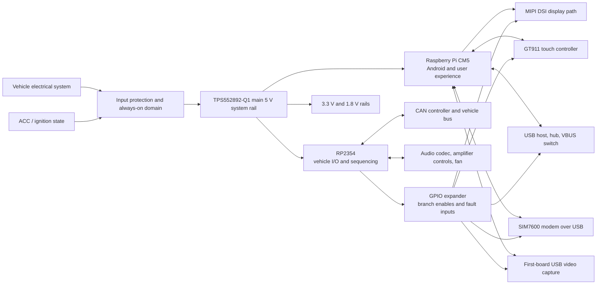
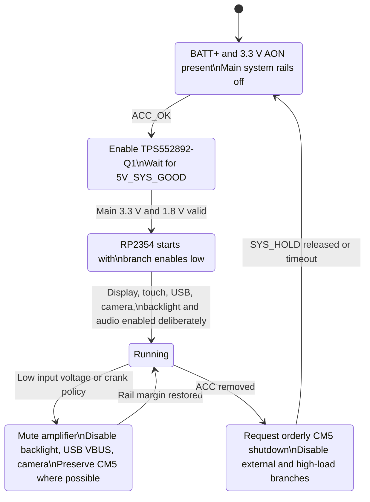
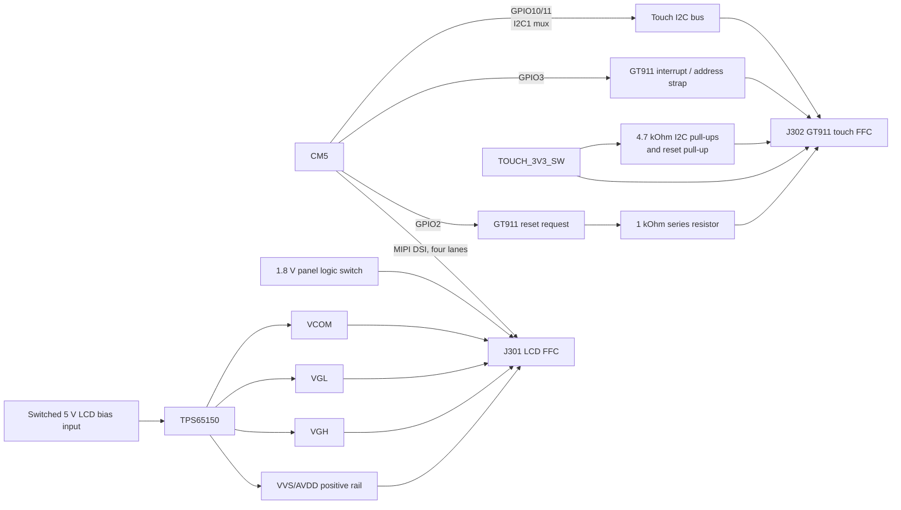
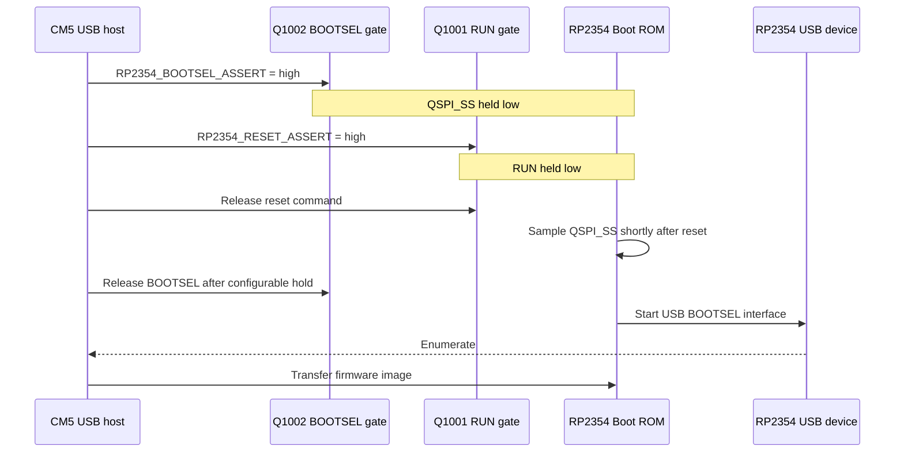
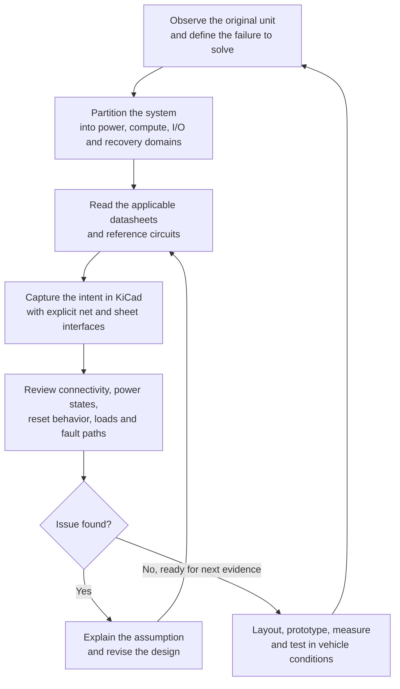

# OpenXTCM5: Rebuilding an Android Head Unit as a Repairable System

> **Project status, October 2026:** This is a pre-layout design journal, not a finished-product announcement. The schematic has been reviewed sheet by sheet and is ready for board floorplanning and component placement. Before detailed routing is committed, the remaining parent-sheet interconnects and ERC findings must be reconciled against the Production design variant. No PCB layout, prototype, thermal test, vehicle transient test, or full hardware validation has been completed yet.

OpenXTCM5 is my in-progress open-hardware attempt to build a more capable and repairable Android head unit around a Raspberry Pi Compute Module 5 (CM5). It is also a deliberately ambitious learning project. The goal is not to replace a head unit by making a larger single-board computer. It is to understand the system boundaries that make an in-vehicle computer dependable: power behavior, recovery paths, display biasing, audio heat, external-port protection, vehicle I/O, and the software contracts between them.

The project began with a very practical annoyance. The low-cost Android head unit in my vehicle overheats around its TDA7388 audio amplifier. Once it gets hot, Android becomes severely laggy, reverse-camera use can freeze the system, and audio can repeat the last fragment played until the unit reboots. That failure made the project personal. I did not want to replace one opaque appliance with another. I wanted to build something whose tradeoffs, failure modes, and recovery behavior I could inspect and improve.

The result is a system with two intentional brains:

- A **Raspberry Pi CM5** for Android, the display, USB-host duties, modem integration, camera applications, and the user-facing experience.
- An **RP2354** for power sequencing, vehicle-state handling, CAN, audio-codec control, fan control, and fault-aware recovery.

That split is not a claim that a CM5 cannot toggle a GPIO. It is an architectural decision: the computer that renders a map should not be solely responsible for deciding what happens when the vehicle supply dips or when an external rail faults.

## The System I Am Building

The board is being designed as a vehicle-facing platform rather than a generic CM5 carrier. It accepts vehicle power, maintains a tiny always-on domain for ACC sensing and orderly wake/shutdown, generates a controlled 5 V system rail, and selectively powers subsystems that benefit from isolation or real recovery.

The current schematic includes these major paths:

- Protected vehicle input and an always-on supervisory domain.
- A TPS552892-Q1 buck-boost stage for `+5V_SYS`, intended to keep the core system viable through automotive voltage variation.
- CM5 compute, Android, USB host, display DSI, and modem connectivity.
- RP2354 vehicle I/O, CAN through a TCAN4550-Q1, thermal control, audio control, and power policy.
- A TCA9539A-Q1 GPIO expander for low-rate branch enables and active-low fault reporting.
- Display logic, panel-bias rails, a GT911 touch interface, backlight control, and dedicated FFC connectors.
- A TLV320AIC3104 codec and TDA7850 audio amplifier path, with active cooling planned for the amplifier region.
- USB, a SIM7600NA-H mini-PCIe modem path, front/rear I/O, and a first-board MS2106E USB capture route for the reverse camera.
- A self-powered USB-C maintenance connection for CM5 recovery that deliberately does not attempt to power the board from a development host.

The diagram below captures the intended ownership boundaries. It is not a PCB routing diagram. It is the answer to a more important early question: which subsystem owns each behavior when the vehicle is not behaving politely?

<!-- Source: diagrams/system-architecture.mmd -->

## The First Big Decision: Power Is a State Machine

One of the most useful things I learned early is that a net name does not describe a power policy. A label such as `+3V3`, `5V_SYS_GOOD`, or `TOUCH_3V3_SW` says what is connected. It does not say why the rail exists, who may turn it off, what can back-power it, or whether removing it is actually a useful recovery action.

The project therefore separates **global power control** from **branch power control**.

Global control decides whether the head unit is awake. The protected vehicle input and `+3V3_AON` domain remain available while the vehicle is parked. An ACC event permits the TPS552892-Q1 stage to bring up `+5V_SYS`. Once that rail is valid, the main 3.3 V and 1.8 V rails can start and the RP2354 can sequence the rest of the system.

Branch control is intentionally narrower. A branch switch earns its place only when it protects an external connector, sheds meaningful load, allows a genuine power-cycle recovery, or avoids a harmful back-power path. This is why USB VBUS, camera power, LCD bias, and touch power are separately controlled, while every small logic rail is not automatically switched just for the sake of having another enable signal.

<!-- Source: diagrams/power-state-machine.mmd -->

This framing changed the design. I stopped asking, "Can I put a load switch here?" and started asking, "What failure does this switch let me contain or recover from?" The difference is subtle in a schematic and substantial in a real vehicle.

For example, the backlight is a good early load to shed during a low-voltage event because it removes meaningful power without immediately disrupting the CM5. USB VBUS and camera power are controlled because they leave the board and can fault externally. Touch power is switchable because a stuck controller benefits from a real power cycle, not because its normal operating current is especially large.

## Designing for the Display I Actually Have, Not an Abstract Display

The display section has been the most instructive part of the project so far. The panel is not simply "MIPI DSI plus 5 V." It needs a high-speed DSI interface, panel logic power, level-shifted control signals, a backlight path, a separate PCAP touch flex, and several analog panel-bias rails.

The CM5 provides four-lane MIPI DSI to the 30-pin LCD FFC connector. The panel logic receives switched 1.8 V, and reset/standby are translated from the controller's 3.3 V domain through an SN74LVC2T45. The translator choice matters: when the panel-side rail is absent, it needs to avoid letting the still-powered controller side create undefined panel signals.

The analog portion is generated by a TPS65150PWPR. Its 5 V input is independently switched so firmware can remove the entire LCD-bias domain for recovery. The device produces the panel rails commonly called `AVDD`, `VGH`, `VGL`, and `VCOM`.

One schematic detail became a useful lesson in topology: `VVS/AVDD` and `AVDD` are deliberately different nets on opposite sides of R309. The resistor is a 0-ohm link, but it is still a meaningful link. If both sides carried the same net name, KiCad would connect around the resistor and the link would no longer provide a controlled assembly option or a clear isolation boundary. The panel side remains `AVDD`; the regulator side is named `VVS/AVDD` to preserve that intent.

The LCD FFC also includes several optional lines for alternate driver configurations. I deliberately left the associated I2C and MIPI-to-LVDS control options DNP because they are not used by the panels I expect to support. Leaving a plausible-but-unused path unstuffed is not an omission when it is documented. It is a compatibility option with a defined boundary.

<!-- Source: diagrams/display-touch-stack.mmd -->

### The TPS65150 Review Was a Lesson in Reading the Whole Reference Circuit

The TPS65150 initially looked like a compact way to obtain the panel's bias voltages. It is, but the value is not in the part number alone. Its boost path, positive and negative charge pumps, feedback dividers, compensation, diode voltage rating, capacitor voltage rating, and rail labels all have to agree with one another.

The current draft follows the device's 5 V reference topology closely:

- The positive rail is labelled `VVS/AVDD` at the regulator and links through R309 to panel-side `AVDD`.
- The boost feedback path uses 820 kOhm and 75 kOhm resistors, with a 22 pF feed-forward capacitor.
- The external boost diode is a DFLS240LX-7, selected with more reverse-voltage margin than the earlier 20 V placeholder.
- The positive charge-pump capacitor is 330 nF / 35 V, and the high-voltage capacitors have explicit voltage ratings.
- `VCOM` receives its dedicated capacitor, while `VGH` follows the reference circuit without an added output capacitor.

I also made a cost decision here: the selected TPS65150PWPR is the commercial part rather than the automotive-qualified Q1 version. That does not make it automatically wrong, but it moves environmental qualification into the risk register. In an automotive project, a lower unit price and an automotive suffix are not interchangeable design inputs. The future prototype must establish whether the actual installation environment, thermals, and reliability target justify that choice.

## Touch: A Small Connector Exposed a Big Systems Problem

The GT911 touch controller is connected through its own six-pin FFC. This was easy to misunderstand at first because the LCD connector has unpopulated I2C configuration pins. Those pins belong to optional display-driver variants, not the PCAP touch controller. The bonded touch flex has its own physical pinout: reset, 3.3 V, ground, interrupt, SDA, and SCL.

The touch circuit now includes:

- `TOUCH_3V3_SW` for controlled power and targeted recovery.
- A 10 kOhm reset pull-up on the GT911 side of a 1 kOhm series resistor.
- `GPIO2` for active-low reset and `GPIO3` for the GT911 interrupt/address-selection signal.
- A dedicated hardware I2C path on CM5 GPIO10/GPIO11, muxed as I2C1.
- 4.7 kOhm pull-ups from SDA and SCL to `TOUCH_3V3_SW`.

The biggest discovery was that I2C is inseparable from power sequencing. Initially, touch was on the CM5 display I2C pair. Those pins have fixed pull-ups to the CM5's 3.3 V rail. Moving external pull-ups to a switched touch rail would not have isolated an unpowered GT911 because the fixed pull-ups would still drive the bus high.

The solution was not simply to move resistors. It was to choose a different CM5 I2C-capable GPIO pair without fixed pull-ups, then place the bus pull-ups on `TOUCH_3V3_SW`. That gives the touch bus a meaningful off state, as long as firmware leaves those CM5 pins high impedance before touch power is removed.

I also learned that both I2C wires are electrically bidirectional. SDA is obviously shared. SCL is master-originated, but a slave can hold the open-drain clock line low for clock stretching. This is why both the SDA and SCL hierarchical labels are represented as bidirectional in KiCad. Getting the symbol direction right will not repair a PCB, but it makes electrical intent legible and lets ERC help instead of becoming background noise.

## Recovery Is a Hardware Feature, Not an Afterthought

The CM5 runs the experience people see, but the RP2354 owns the real-time vehicle behavior. That split only works if the controller also has a practical recovery path when its own firmware needs replacement. I reserved the RP2354 USB data pair for a CM5 USB host and added two CM5-controlled, active-high gate commands: `RP2354_RESET_ASSERT` and `RP2354_BOOTSEL_ASSERT`. The child-sheet USB labels still need their final parent-sheet connection.

The naming matters. The CM5 never drives the RP2354 `RUN` pin or `QSPI_SS` line directly. Instead, each CM5 GPIO drives the gate of a local low-side MOSFET. One MOSFET asserts reset by pulling `RUN` low; the other requests BOOTSEL by pulling `QSPI_SS` low. Gate pulldowns release both commands while the CM5 is booting or its GPIOs are high impedance, and physical pushbuttons remain available for bench recovery.

This turned a copied note into a documented electrical contract: assert BOOTSEL, assert reset, release reset, hold BOOTSEL through the Boot ROM sample window, then release it and wait for USB enumeration. The initial firmware will use conservative, configurable timing rather than pretending an undocumented fixed delay is universal. The RP2350 Boot ROM samples `QSPI_SS` shortly after reset; holding it low selects BOOTSEL, and the standard configuration proceeds to the USB bootloader.

<!-- Source: diagrams/rp2354-firmware-update.mmd -->

The recovery path is intentionally not part of normal vehicle startup. It should require an explicit privileged action, release both gates on a timeout, and leave BOOTSEL inactive before any ordinary reset. I had initially thought of firmware update as a software concern. This part of the design made the boundary clearer: the reliable version starts with a reset path, a boot strap, a USB connection, and safe defaults in the hardware.

### A Service Connector Is Not a Power Supply

The external USB-C connector, J1402, is a CM5 device/UFP maintenance port for storage recovery and provisioning. It is not a normal Android host port, and it is not a way to power the head unit. The board must be powered from its normal vehicle or bench supply before a development host is connected.

That decision has concrete schematic consequences: J1402 VBUS is intentionally NC, each CC pin has its own 5.1 kOhm UFP pull-down to ground, and the CM5 CC pins are not used. It prevents an accidental design assumption that a PC port or powered USB hub can supply the head unit's operating current. A small connector can define a surprisingly large part of the product's recovery and safety story.

## What I Brought In, What I Had to Learn

I started with a useful but incomplete mental model. I knew the system needed protected vehicle power, a capable compute platform, a stable display, a reverse camera, communications, audio, and sensible cooling. I also knew the original head unit's thermal failure was not a software problem that could be solved with a faster processor.

What I did not yet know was how many engineering decisions live in the space between a connector and an IC:

1. **A net name is not a control signal.** `FRONT_I/O_SW_EN` was a net name, not proof that it controlled USB VBUS. I had to trace its actual destination and confirm it reached the enable pin of the load switch.
2. **A 0-ohm resistor only matters if topology preserves it.** Identical net labels on both sides silently defeat the component's purpose.
3. **Power-off state is a first-class design condition.** An unpowered IC can be partially energized through reset, interrupt, I2C, USB, or analog lines. "The rail is off" is not enough.
4. **Panel power is an analog subsystem.** It needs appropriate diode and capacitor voltage ratings, compensation values, sequence control, and reference-circuit discipline.
5. **Cost is an engineering input, not a shortcut.** Replacing an automotive-qualified part requires a clear record of the risk being accepted and a validation plan that can challenge the decision.
6. **Controllers should own the behaviors they can keep doing under stress.** The RP2354 can protect, sequence, and shed loads while the CM5 is occupied with Android or recovering from a fault.

These were not abstract lessons. Each one came from a real schematic review, a discovered assumption, or a component whose apparently simple role had an off-state behavior I had not fully accounted for.

## Design Review as an Engineering Tool

The most valuable part of this project so far has been the review loop. I am treating the schematic as an argument that needs evidence, not a drawing that becomes correct because it looks neat. The loop is simple, but it works when repeated honestly.

<!-- Source: diagrams/design-review-loop.mmd -->

### KiCad Variants Are Design Data

One of the more humbling tooling lessons arrived during a cleanup pass: several capacitors appeared to have lost their values in the schematic editor, even though the source file still contained the correct values. The apparent discrepancy was not data loss. I was viewing KiCad's `<Default>` variant while the working BOM values belonged to the `Production` variant.

That changed my review practice. I now treat the selected variant as part of every claim about the design: the variant determines which values, fitted parts, and DNP choices are being inspected. Before changing a suspicious symbol, I check the source instance data, regenerate the Production netlist or BOM, and compare the resulting connectivity. This avoided a destructive "fix" for a problem that was really a configuration-selection mistake.

The same discipline helped distinguish a genuine electrical problem from an ERC presentation warning. For example, the LCD `VCOM` path is intentionally split by R301 between the TPS65150 bias rail and J301 panel connector. The Production netlist verified both sides of the link, even though one labeled wire segment attracted an ERC warning. ERC remains useful, but it is evidence to investigate, not a substitute for understanding the circuit.

The next review focus is not aesthetic cleanup. It is proving every interface across the hierarchy and every off-state boundary before routing locks the choices in place:

- Finish parent-sheet connections for every hierarchical label and run ERC on the completed design.
- Review each remaining ERC finding as either a corrected electrical issue or a documented, intentional rule exception; do not simply train myself to ignore the report.
- Reconcile schematic symbols, footprints, connector orientations, and the actual FPC/flex drawings.
- Calculate rail current, inrush, thermal dissipation, and copper requirements with the final component set.
- Start floorplanning with the board outline, mounting constraints, external connectors, CM5, modem, display FFCs, power conversion, and amplifier thermal zone. Treat high-speed MIPI, USB, PCIe, and switching loops as layout problems, not merely netlist problems.
- Build a bench-validation plan before layout freeze, including real crank behavior, thermal tests, USB short-circuit behavior, touch recovery, display sequencing, modem bursts, and reverse-camera time-to-first-frame.

## What Comes Next

The project is still before the hard part. A coherent, reviewed schematic is an important milestone, but it is not hardware proof. The immediate next phase is floorplanning and placement; detailed routing follows only once the hierarchy and ERC review establish a settled electrical contract. After that come a structured prototype bring-up and testing in the environment that motivated the project in the first place.

I expect more assumptions to fail. That is not a sign the effort has gone wrong. It is the point of making the assumptions explicit before the PCB makes them expensive.

OpenXTCM5 is becoming a portfolio project because it shows more than a final board. It documents how I turn an observed product failure into system requirements, partition responsibility between processors and power domains, revise a design when the evidence changes, and preserve the reasoning for the next person, including future me.

## Project References

The living technical records in this repository remain the source of truth for the evolving design:

- `README.md` for the problem statement and project status.
- `docs/power-control-rationale.md` for rail ownership, branch-switch policy, and fault/recovery rules.
- `docs/firmware-implementation-plan.md` for the RP2354 and GPIO-expander contract.
- `docs/mipi-csi-camera-integration.md` for the first-board USB capture path and the future CSI-2 option.
- `docs/sim7600na-h-android-integration.md` for modem/Android integration planning.
- `*.kicad_sch` for the current schematic implementation.

## Diagram Sources

- [System architecture](diagrams/system-architecture.mmd)
- [Power state machine](diagrams/power-state-machine.mmd)
- [Display and touch stack](diagrams/display-touch-stack.mmd)
- [RP2354 firmware update and recovery](diagrams/rp2354-firmware-update.mmd)
- [Design review loop](diagrams/design-review-loop.mmd)
